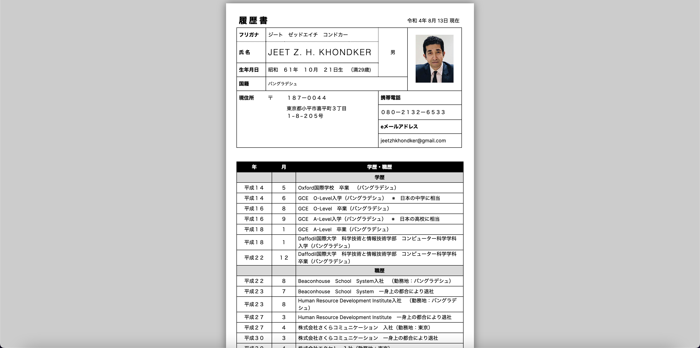

# 履歴書

## Overview・概要

**履歴書** is a Website/Cloud version of Japanese resume (履歴書). Currently **履歴書** has been designed and built on an A4-size layout page format. **履歴書** is fully supported in every browsers and devices.

## Version・バージョン

2022 年 08 月 13 日　 1.0 - Taking the initial first step to design and develop a website for **履歴書**.

## Features & Functions・特徴と機能

- Current Date Display in Japanese Date Format (令和４　 8 月　 11 日）
- Phone call to the person of the **履歴書** by clicking on the phone number (携帯電話)
- Email Sending to the email address mentioned in the **履歴書**
- Dynamic page adjustment according to devices' width size

## Tools & Technology・特徴と機能

HTML5, CSS3, JavaScript

## Author・作成者

Jeet Z. H. Khondker

## Future Scope/Plan・未来予定

- Source Code Refactoring
- Integration with Portfolio
- Database Integration
- New Features/Plugin Integration
- Different Page Size Format Compatibility
- UI/UX Support + Development
- Multiple Usability
- Conversion from Web Site to Web Application
